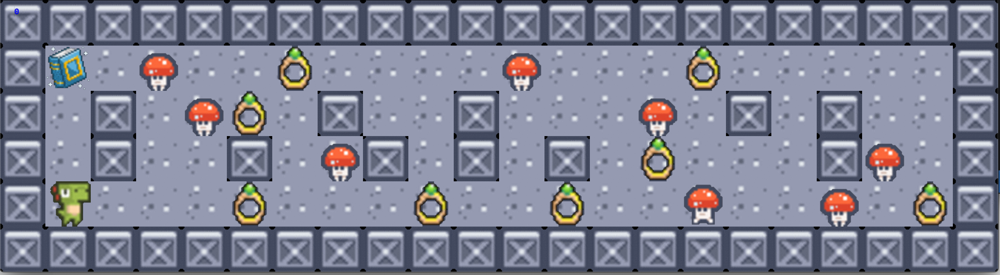

# so_long, And thanks for all the fish!
Let's make a mini-game using the mlx library.

### Synopsis - Dino advanture!
Dino is a young dinosaur with magical powers.  
To become a powerful dinosaur, Dino must go on an adventure
to get his very own spell book and collect the mystical rings.  
With the spell book and the rings, Dino can become the master of magic!   
But be careful, there are poisonous mushrooms monsters lurking near the rings and the spellbook.  

**Move Dino with 'W', 'A', 'S', 'D', escape from the poisonous mushrooms, collect magic rings and activate the spell book.**  



### How to play
**start**
```
> make
> ./so_long map/map.ber
```
**move**
w: up  
a: left  
s: down  
d: right  
esc: exit the game

### Code
Instead of loading all the map images each time, update only the images at specific coordinates when game components (Dino, enemies, rings, spellbook) change.

```c
static int	rendering(t_game *game)
{
	if (game->game_start == 0)
	{
		mlx_clear_window(game->mlx, game->dino_advanture);
		display_map(game);
		game->game_start = 1;
	}
	display_footprint(game);
	load_dino_sprites(game, \
		game->player_position[1], game->player_position[0]);
	move_enemy(game);
	return (0);
}

static int	game_controller(t_game *map_info)
{
	mlx_hook(map_info->dino_advanture, 17, 0, handle_close_button, NULL);
	mlx_key_hook(map_info->dino_advanture, move_player, map_info);
	mlx_loop_hook(map_info->mlx, rendering, map_info);
	mlx_loop(map_info->mlx);
	return (0);
}

void	so_long(char *map_file)
{
	t_game	*map_info;

	map_info = malloc(sizeof(t_game));
	if (!map_info)
		return ;
	ft_memset(map_info, 0, sizeof(t_game));
	if (map_init(map_info, map_file) == ERROR)
		exit(0);
	if (check_map(map_info) == ERROR)
		finish_game(map_info);
	open_image(map_info);
	game_controller(map_info);
	finish_game(map_info);
}
```

```c
static int	get_random_direction(void)
{
	return (rand() % 4);
}

static int	move_enemy_in_direction(t_game *game, \
	int direction, int *enemy_position)
{
	int	new_x;
	int	new_y;

	new_x = enemy_position[1];
	new_y = enemy_position[0];
	if (direction == 0)
		new_y--;
	else if (direction == 1)
		new_x++;
	else if (direction == 2)
		new_y++;
	else if (direction == 3)
		new_x--;
	else
		return (0);
	if (!is_valid_move(game, new_x, new_y))
		return (0);
	game->map[new_y][new_x] = 'M';
	game->map[enemy_position[0]][enemy_position[1]] = '0';
	put_image(game, enemy_position[1], enemy_position[0], game->road);
	put_image(game, new_x, new_y, game->enemy[(new_x + new_y) % 2]);
	enemy_position[1] = new_x;
	enemy_position[0] = new_y;
	return (1);
}

static int	move_randomely(t_game *game, int *enemy_position)
{
	int			direction;

	if (find_enemy(game, enemy_position[1], \
		enemy_position[0], enemy_position) == -1)
		return (-1);
	direction = get_random_direction();
	move_enemy_in_direction(game, direction, &enemy_position[0]);
	return (1);
}

void	move_enemy(t_game *game)
{
	static int	enemy_move_counter;
	static int	enemy_position[2];
	static int	count;
	int			move_num;

	enemy_move_counter++;
	if (count == 0)
	{
		count = game->num_cepm[3];
		ft_memset(enemy_position, 0, sizeof(enemy_position));
	}
	if (enemy_move_counter < MOVE_THRESHOLD)
		return ;
	enemy_move_counter = 0;
	move_num = 3;
	while (move_num)
	{
		move_randomely(game, enemy_position);
		enemy_position[1]++;
		move_num--;
	}
	count--;
	return ;
}
```